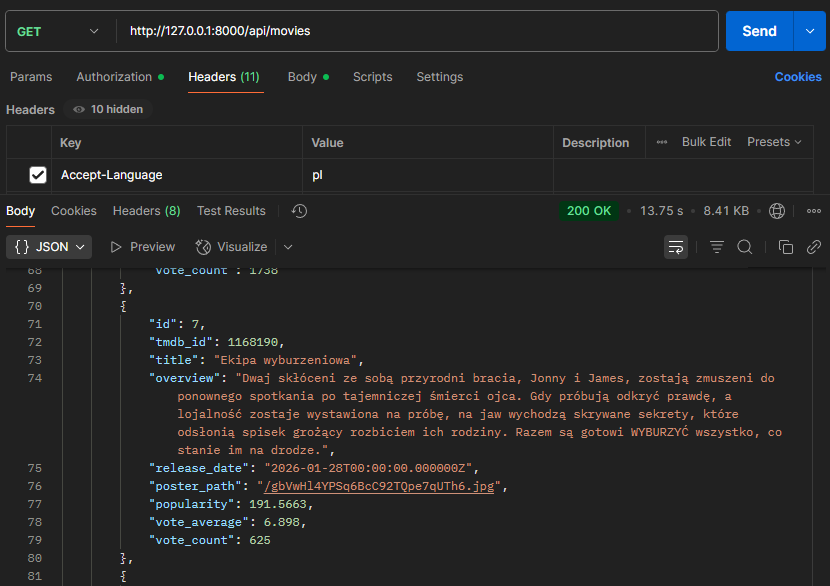
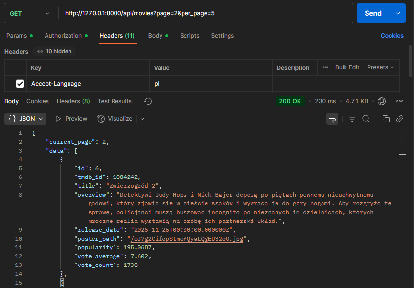
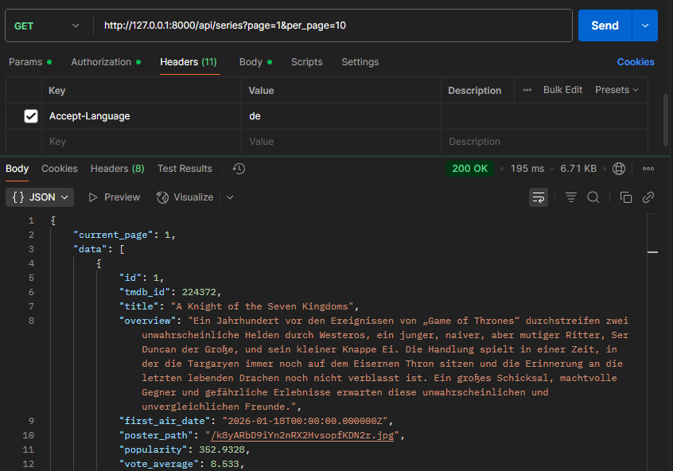
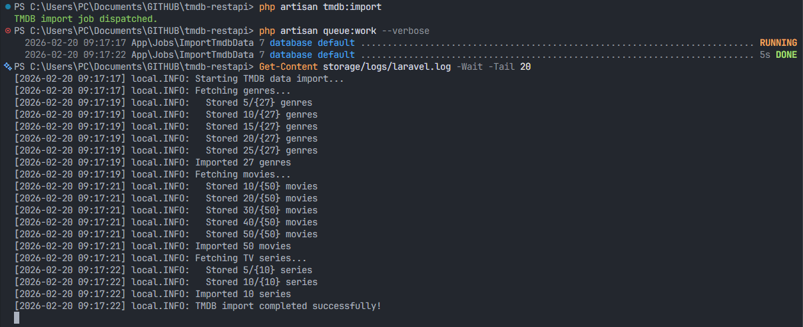

## TMDB REST API

Laravel REST API with multilingual support for movies and TV series data from TMDB, featuring a Livewire-powered dashboard and Docker deployment.


### API Endpoints

All endpoints accept the `Accept-Language` header (`en`, `pl`, `de`) and support pagination (for movies/series) via `?page=` and `?per_page=`.

#### List movies
`GET /api/movies`

**Query params:**
- `page` (int, optional) — page number (default: 1)
- `per_page` (int, optional) — items per page (default: 10)

**Headers:**
- `Accept-Language: pl` (or `en`, `de`)

**Response:**
```json
{
	"current_page": 1,
	"data": [
			{
					"id": 1,
					"tmdb_id": 1236153,
					"title": "90 minut do wolności",
					"overview": "W świecie bliskiej przyszłości wymiar sprawiedliwości przechodzi rewolucję. Mercy - sąd oparty na zaawansowanej sztucznej inteligencji - ma dostęp do wszystkich kamer, telefonów i baz danych. Jego werdyk-ty są szybkie, niepodważalne i... ostateczne.  Gdy detektyw John Kross zostaje oskarżony o zamordowa-nie żony, trafia przed trybunał, który sam kiedyś popierał. Przed sędzią Al ma zaledwie 90 minut, by udowodnić swoją niewinność. Jeśli mu się nie uda, zostanie stracony.  W Mercy obowiązuje zasada: to oskarżony musi udowodnić, że jest niewinny. W świecie, gdzie tradycyjne sądy zawodzą, ten system obiecuje koniec bezkarności. Ale w rękach niewłaściwych ludzi może stać się narzędziem doskonałej niesprawiedliwości.  Pełen napięcia thriller, który trzyma za gardło od pierwszej do ostatniej minuty.",
					"release_date": "2026-01-20T00:00:00.000000Z",
					"poster_path": "/pyok1kZJCfyuFapYXzHcy7BLlQa.jpg",
					"popularity": 516.1282,
					"vote_average": 6.7,
					"vote_count": 251
			},
		...
	],
	...
}
```

#### List series
`GET /api/series`

**Query params:**
- `page`, `per_page` (as above)

**Headers:**
- `Accept-Language: de` (or `en`, `pl`)

**Response:**
```json
{
	"current_page": 1,
	"data": [
			{
					"id": 1,
					"tmdb_id": 224372,
					"title": "A Knight of the Seven Kingdoms",
					"overview": "Ein Jahrhundert vor den Ereignissen von „Game of Thrones“ durchstreifen zwei unwahrscheinliche Helden durch Westeros, ein junger, naiver, aber mutiger Ritter, Ser Duncan der Große, und sein kleiner Knappe Ei. Die Handlung spielt in einer Zeit, in der die Targaryen immer noch auf dem Eisernen Thron sitzen und die Erinnerung an die letzten lebenden Drachen noch nicht verblasst ist. Ein großes Schicksal, machtvolle Gegner und gefährliche Erlebnisse erwarten diese unwahrscheinlichen und unvergleichlichen Freunde.",
					"first_air_date": "2026-01-18T00:00:00.000000Z",
					"poster_path": "/k8yARbD9iYn2nRX2HvsopfKDN2r.jpg",
					"popularity": 352.9328,
					"vote_average": 8.533,
					"vote_count": 330
			},
		...
	],
	...
}
```

#### List genres
`GET /api/genres`

**Headers:**
- `Accept-Language: en` (or `pl`, `de`)

**Response:**
```json
{
    "current_page": 1,
    "data": [
        {
            "id": 1,
            "tmdb_id": 28,
            "name": "Action"
        },
        {
            "id": 20,
            "tmdb_id": 10759,
            "name": "Action & Adventure"
        },
        {
            "id": 2,
            "tmdb_id": 12,
            "name": "Adventure"
        },
		...
	],
	...
```

### API Examples

**Example 1: Get movies with Polish language**



**Example 2: Get movies with pagination (page 2, 5 per page)**



**Example 3: Get series with German language with pagination (page 1, 10 per page)**



### Importing data from TMDB

The application uses Laravel's queue system to import data from TMDB API in the background. This allows for efficient processing of large datasets without blocking the main application.

1. Place your TMDB API key in `tmdb-api.txt` (project root).
2. Dispatch the import job:
     ```powershell
     php artisan tmdb:import
     ```
3. Start the queue worker to process the job:
     ```powershell
     php artisan queue:work --verbose
     ```
4. The job will fetch and store movies, series, and genres with multilingual support (EN, PL, DE).
5. Data will be available via API and dashboard after import completes.



### Running the project

#### Option 1: Local development

1. Install dependencies:
	 ```powershell
	 composer install
	 npm install
	 npm run build
	 ```
2. Run migrations:
	 ```powershell
	 php artisan migrate
	 ```
3. Start the server:
	 ```powershell
	 php artisan serve
	 ```
4. Visit [http://127.0.0.1:8000](http://127.0.0.1:8000)

#### Option 2: Docker

1. Build and start containers:
	 ```powershell
	 docker compose up --build
	 ```
2. Visit [http://localhost:8000](http://localhost:8000)


### Tests

Run the test suite:
```powershell
php artisan test
```


---
The Laravel framework is open-sourced software licensed under the [MIT license](https://opensource.org/licenses/MIT).
