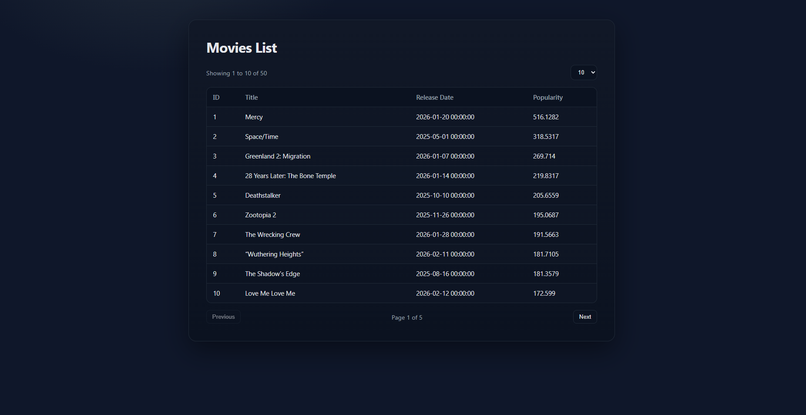
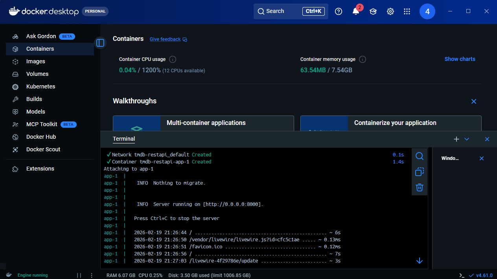
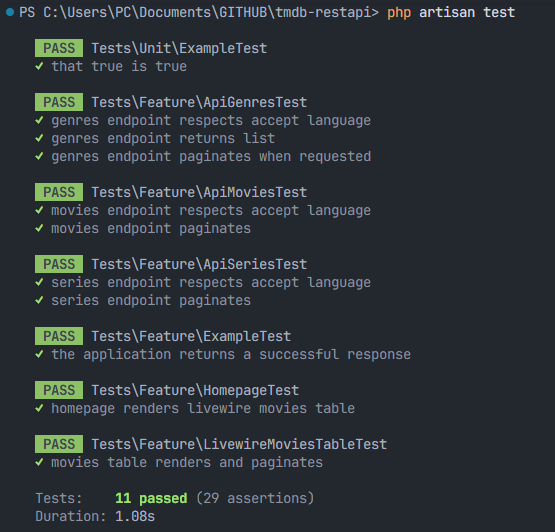

## TMDB REST API

Laravel REST API with multilingual support for movies and TV series data from TMDB, featuring a Livewire-powered dashboard and Docker deployment.



### API Endpoints

All endpoints accept the `Accept-Language` header (`en`, `pl`, `de`) and support pagination (for movies/series) via `?page=` and `?per_page=`.

#### List movies
`GET /api/movies`

**Query params:**
- `page` (int, optional) — page number (default: 1)
- `per_page` (int, optional) — items per page (default: 10)

**Headers:**
- `Accept-Language: pl` (or `en`, `de`)

**Response:**
```json
{
	"current_page": 1,
	"data": [
		{
			"id": 1,
			"tmdb_id": 123,
			"title": "Tytuł po polsku",
			"overview": "Opis po polsku",
			"release_date": "2020-01-01",
			"poster_path": "/path.jpg",
			"popularity": 123.45,
			"vote_average": 7.8,
			"vote_count": 100
		},
		...
	],
	...
}
```

#### List series
`GET /api/series`

**Query params:**
- `page`, `per_page` (as above)

**Headers:**
- `Accept-Language: de` (or `en`, `pl`)

**Response:**
```json
{
	"current_page": 1,
	"data": [
		{
			"id": 1,
			"tmdb_id": 456,
			"title": "Serientitel auf Deutsch",
			"overview": "Beschreibung auf Deutsch",
			"first_air_date": "2021-01-01",
			"poster_path": "/path.jpg",
			"popularity": 99.9,
			"vote_average": 8.1,
			"vote_count": 50
		},
		...
	],
	...
}
```

#### List genres
`GET /api/genres`

**Headers:**
- `Accept-Language: en` (or `pl`, `de`)

**Response:**
```json
[
	{ "id": 1, "tmdb_id": 12, "name": "Action" },
	...
]
```

### Importing data from TMDB

1. Place your TMDB API key in `tmdb-api.txt` (project root).
2. Run import job:
	 ```powershell
	 php artisan tmdb:import
	 php artisan queue:work
	 ```
3. Data will be available via API and dashboard.

### Running the project

#### Option 1: Local development

1. Install dependencies:
	 ```powershell
	 composer install
	 npm install
	 npm run build
	 ```
2. Run migrations:
	 ```powershell
	 php artisan migrate
	 ```
3. Start the server:
	 ```powershell
	 php artisan serve
	 ```
4. Visit [http://127.0.0.1:8000](http://127.0.0.1:8000)

#### Option 2: Docker

1. Build and start containers:
	 ```powershell
	 docker compose up --build
	 ```
2. Visit [http://localhost:8000](http://localhost:8000)



### Tests

Run the test suite:
```powershell
php artisan test
```



---
The Laravel framework is open-sourced software licensed under the [MIT license](https://opensource.org/licenses/MIT).
